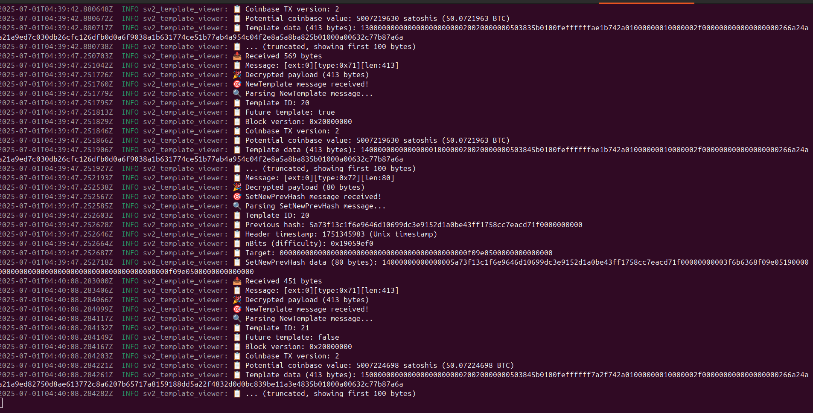
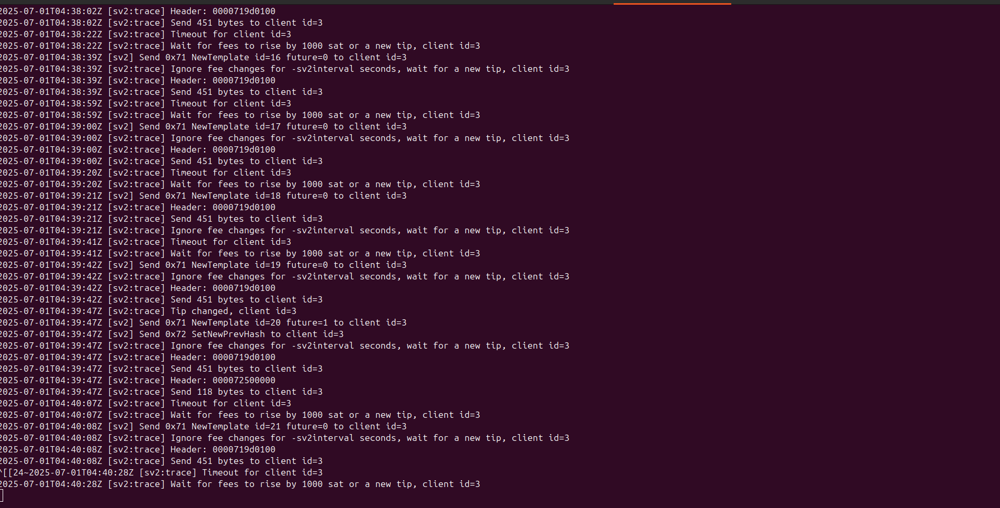
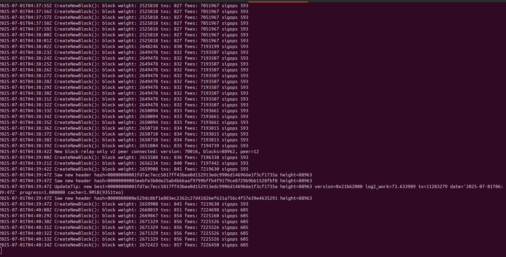

# SV2 Template Viewer

A Stratum V2 template viewer that connects to `bitcoin-mine` template provider and displays live Bitcoin block templates in real-time.

## Overview

This project demonstrates a working Stratum V2 client built from core SV2 crates, connecting to Sjors' Bitcoin Core SV2 integration to receive and parse actual Bitcoin block templates.

## Features

- ✅ **Noise Protocol Encryption** - Secure SV2 handshake and communication
- ✅ **SV2 Message Framing** - Proper encrypted message handling
- ✅ **Real-time Template Streaming** - Live Bitcoin block templates
- ✅ **Template Parsing** - Extract template ID, coinbase value, difficulty
- ✅ **Tip Change Detection** - Monitor Bitcoin network tip changes
- ✅ **Multi-message Processing** - Handle batched SV2 messages

## Screenshots


*Live template reception and parsing*


*Template provider sending templates*


*Bitcoin Core generating block templates*

## Quick Start

### Prerequisites

- Rust (latest stable)
- Bitcoin Core with SV2 support (Sjors' fork)

### Setup Bitcoin Node & Template Provider

1. Download Bitcoin SV2 binaries:
```bash
wget https://github.com/Sjors/bitcoin/releases/download/sv2-tp-v0.1.17-ipc/bitcoin-sv2-tp-0.1.17-ipc-x86_64-linux-gnu.tar.gz
tar -xzf bitcoin-sv2-tp-0.1.17-ipc-x86_64-linux-gnu.tar.gz
cd bitcoin-sv2-tp-0.1.17-ipc/bin

Start Bitcoin node (testnet4):

bash./bitcoin-node -testnet4 -ipcbind=unix

Start template provider:

bash./bitcoin-mine -testnet4 -sv2port=8442 -sv2interval=20 -sv2feedelta=1000 -debug=sv2 -loglevel=sv2:trace
Run Template Viewer
bashgit clone https://github.com/[YOUR_USERNAME]/sv2-template-viewer
cd sv2-template-viewer
cargo run
Technical Details
Architecture

Noise Protocol: Implements NX handshake for secure communication
SV2 Framing: Separate header/payload encryption as per SV2 spec
Message Processing: Handles multiple SV2 messages in single TCP reads
Template Parsing: Extracts meaningful data from binary template format

SV2 Messages Handled

0x00 SetupConnection
0x01 SetupConnectionSuccess
0x70 CoinbaseOutputConstraints
0x71 NewTemplate
0x72 SetNewPrevHash

Dependencies
toml[dependencies]
tokio = { version = "1.0", features = ["full"] }
tracing = "0.1"
tracing-subscriber = "0.3"
anyhow = "1.0"
hex = "0.4"
roles_logic_sv2 = { git = "https://github.com/stratum-mining/stratum.git" }
binary_sv2 = { git = "https://github.com/stratum-mining/stratum.git" }
noise_sv2 = { git = "https://github.com/stratum-mining/stratum.git" }
key_utils = { git = "https://github.com/stratum-mining/stratum.git" }
What You'll See
The template viewer displays:

Template IDs: Sequential template identifiers
Future vs Active: Whether templates are for future use or immediate mining
Coinbase Values: Block reward + fees (typically ~50+ BTC on testnet4)
Block Versions: Bitcoin block version fields
Tip Changes: When new blocks are found on the network
Previous Hashes: Bitcoin block chain progression

Implementation Notes
Built from first principles using core SV2 crates rather than the full stratum framework. This provides:

Deep understanding of SV2 protocol mechanics
Minimal dependencies and clean implementation
Direct Bitcoin Core integration (not mock data)
Production-ready foundation for mining applications

Contributing
Feel free to open issues or submit PRs to improve the template viewer!
License
MIT License